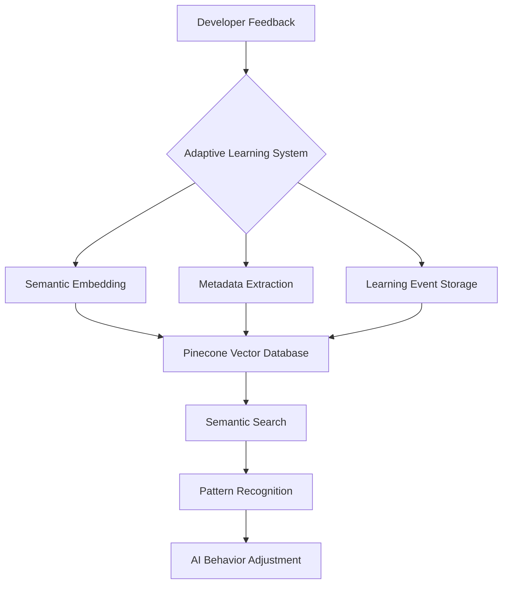

# 🧠 Adaptive Learning System: Revolutionizing AI Development

## 📘 Overview

### The Problem with Traditional AI Learning
Current AI systems suffer from critical limitations:
- Repetitive mistakes
- Lack of contextual memory
- No direct developer intervention
- Rigid, non-adaptive behavior

### Our Solution: Adaptive Learning System (ALS)

Project Overseer introduces a groundbreaking Adaptive Learning System that transforms how AI learns and improves.

## 🔬 Core Philosophical Principles

### 1. Developer-Guided Intelligence
- Developers are active participants in AI learning
- Direct feedback mechanism
- Transparent learning process

### 2. Semantic Understanding
- Beyond literal code changes
- Capture intent and context
- Learn from subtle nuances

### 3. Continuous Improvement
- Persistent learning memory
- Cross-agent knowledge transfer
- Adaptive behavior modification

## 🚀 Technical Architecture



## 💡 Key Components

### 1. Learning Event Capture
```python
class LearningEvent:
    """Comprehensive learning interaction representation"""
    agent_id: str           # Which agent generated content
    timestamp: DateTime     # When event occurred
    original_context: Dict  # Generation context
    generated_content: str  # AI-produced content
    feedback_type: str      # Positive/Negative/Correction
    human_correction: str   # Optional developer correction
```

### 2. Semantic Embedding
- Convert learning events to high-dimensional vectors
- Capture semantic meaning beyond literal text
- Use state-of-the-art embedding models

### 3. Vector Storage with Pinecone
- Low-latency semantic search
- Scalable learning memory
- Rich metadata support

## 🔍 Learning Workflow

### Step-by-Step Process
1. **Event Generation**
   - AI agent produces content
   - Capture generation context

2. **Developer Feedback**
   - Provide correction or validation
   - Specify feedback type

3. **Semantic Embedding**
   - Convert event to vector representation
   - Extract semantic features

4. **Storage and Indexing**
   - Store in Pinecone vector database
   - Index for fast retrieval

5. **Pattern Recognition**
   - Analyze similar past events
   - Identify learning opportunities

6. **Behavior Adaptation**
   - Adjust AI behavior
   - Prevent repeated mistakes

## 🧪 Example Scenario

```python
# Developer provides feedback on code generation
learning_system.record_event(
    agent_id="ScribeAgent",
    generated_content="def process_data(input_params):",
    feedback_type="NEGATIVE",
    human_correction="def process_data(input_data):"
)

# System learns and adapts
similar_events = learning_system.find_similar_events(
    query="parameter naming conventions"
)
learning_system.adjust_behavior(similar_events)
```

## 🌟 Unique Capabilities

### Intelligent Features
- **Semantic Similarity Search**
  - Find conceptually related learning events
  - Understand context beyond exact matching

- **Cross-Agent Learning**
  - Share insights across different agents
  - Build collective intelligence

- **Adaptive Prompt Engineering**
  - Automatically refine generation prompts
  - Learn from past interactions

## 📊 Performance Metrics

### Learning Effectiveness Indicators
- Reduction in repeated mistakes
- Improvement in code quality
- Decreased manual intervention needed

### Quantitative Tracking
- Event capture rate
- Semantic search accuracy
- Behavior adaptation speed

## 🛡️ Privacy and Security

### Design Principles
- No personal identifiable information stored
- Encrypted vector storage
- Configurable data retention policies

## 🔮 Future Roadmap

### Planned Enhancements
- Multi-modal embedding support
- Advanced pattern recognition
- Explainable AI learning traces
- Machine learning model fine-tuning

## 💻 Integration Guide

### Quick Start
1. Initialize Adaptive Learning System
2. Instrument agents with feedback mechanisms
3. Provide corrections during development

### Configuration
```python
adaptive_learning = AdaptiveLearningSystem(
    api_key=os.getenv('PINECONE_API_KEY'),
    embedding_model='all-MiniLM-L6-v2'
)
```

## 🤝 Community and Collaboration

- Open-source development
- Transparent learning mechanisms
- Developer-driven improvements

---

**Version**: 0.1.0
**Last Updated**: 2025-01-18
**Research Lead**: Paul Wade
