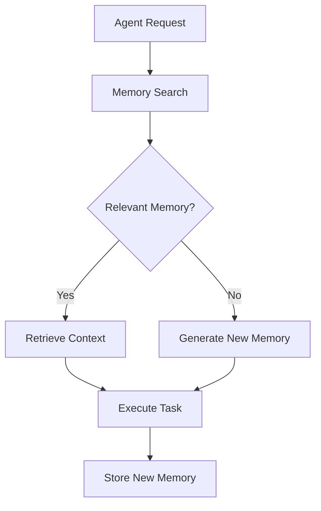
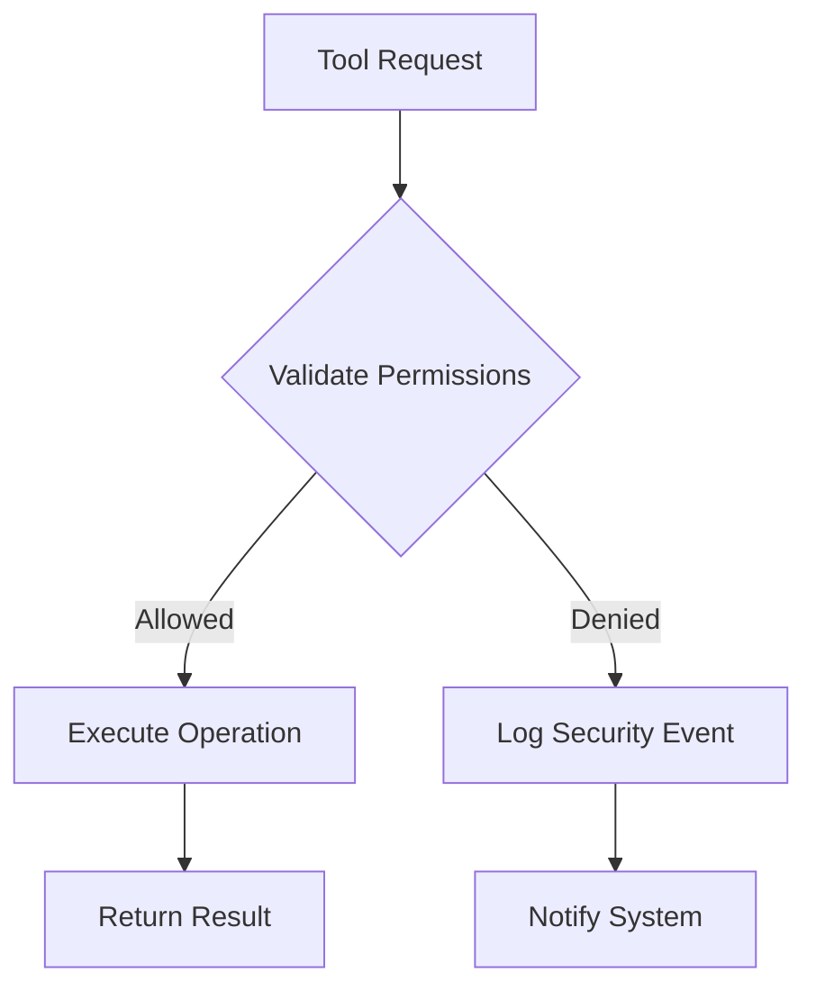

# Project Overseer: Architecture Overview

## 🏗 System Design Philosophy

Project Overseer is built on the principle of creating an autonomous, intelligent development ecosystem capable of understanding, generating, and evolving software systems with minimal human intervention.

## 🧩 Core Components

### 1. Agent System
- **The Scribe**: Responsible for code creation, documentation, and modification
- **The Keeper**: Manages version control and git operations
- **The Watcher**: Handles testing, validation, and quality assurance
- **The Seer**: Focuses on architectural planning and system design

### 2. Memory Architecture
- **Vector-Based Memory**: Powered by Pinecone
- **Semantic Search Capabilities**
- **Cross-Agent Context Sharing**
- **Persistent and Working Memory Modes**

### 3. Tool Ecosystem
- **Filesystem Tools**: Secure file operations
- **Code Analysis Tools**: Static code analysis and generation
- **Testing Tools**: Automated test execution and validation
- **Git Management Tools**: Workflow and version control operations

## 🔍 Interaction Patterns

### Agent Collaboration
1. Task Decomposition
2. Contextual Memory Sharing
3. Parallel Execution
4. Continuous Learning

### Memory Flow

### Tool Execution Security

## 🔒 Security Principles
- Principle of Least Privilege
- Sandboxed Execution Environments
- Comprehensive Logging
- Strict Input Validation

## 🚀 Scalability Considerations
- Asynchronous Agent Operations
- Distributed Memory Management
- Horizontal Scaling Support
- Modular Architecture

## 🔮 Future Evolution
- Enhanced Multi-Model Support
- Advanced Reasoning Capabilities
- Improved Context Understanding
- Self-Optimization Mechanisms
