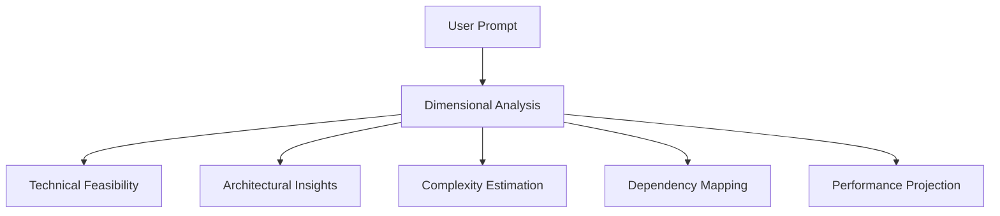

# Multi-Dimensional Intent Analysis (MDIA)

## 🔬 Technical Deep Dive

### 1. Conceptual Framework

Multi-Dimensional Intent Analysis is a sophisticated approach to transforming natural language requirements into precise, actionable software development instructions. Unlike traditional interpretation methods, MDIA employs a holistic, multi-layered analysis technique.

#### Core Philosophical Principles
- **Contextual Comprehension**: Beyond literal interpretation
- **Predictive Intelligence**: Anticipate development challenges
- **Transparent Reasoning**: Expose AI's thought process
- **Adaptive Understanding**: Learn from interaction patterns

### 2. Analysis Dimensions



#### 2.1 Technical Feasibility
- **Objective**: Evaluate implementation probability
- **Metrics**:
  - Language compatibility
  - Existing technology alignment
  - Skill requirement assessment

#### 2.2 Architectural Insights
- **Objective**: Recommend optimal system design
- **Evaluation Criteria**:
  - Microservices vs Monolithic
  - Scalability potential
  - Integration complexity
  - Technology stack suggestions

#### 2.3 Complexity Estimation
```python
class ComplexityModel:
    def estimate(self, requirements):
        return {
            "cognitive_load": self.calculate_cognitive_complexity(),
            "implementation_effort": self.estimate_development_time(),
            "technical_debt_risk": self.predict_maintenance_challenges()
        }
```

#### 2.4 Dependency Mapping
- **Objective**: Identify and analyze external dependencies
- **Components**:
  - Third-party library requirements
  - API integration potential
  - Compatibility analysis
  - Version constraint evaluation

#### 2.5 Performance Projection
- **Metrics**:
  - Estimated computational resources
  - Potential bottlenecks
  - Scaling characteristics
  - Response time predictions

### 3. Machine Learning Integration

#### 3.1 Training Approach
- **Data Sources**:
  - Open-source project repositories
  - Historical development logs
  - Industry best practices documentation

#### 3.2 Model Capabilities
- Contextual understanding
- Predictive complexity analysis
- Adaptive learning from feedback

### 4. Technical Implementation Strategy

```python
class IntentInterpreter:
    def analyze(self, user_prompt: str) -> IntentAnalysis:
        """
        Comprehensive multi-dimensional analysis
        
        Args:
            user_prompt (str): Original user requirement
        
        Returns:
            Structured, multi-dimensional interpretation
        """
        return IntentAnalysis(
            technical_feasibility=self._assess_technical_feasibility(),
            architectural_recommendation=self._recommend_architecture(),
            complexity_score=self._estimate_complexity(),
            dependency_graph=self._map_dependencies(),
            performance_projection=self._project_performance()
        )
```

### 5. Innovative Features

#### 5.1 Transparent AI Reasoning
- Expose decision-making process
- Provide explainable AI insights
- Enable human-in-the-loop refinement

#### 5.2 Adaptive Learning
- Continuous improvement through interaction
- Learn from developer feedback
- Refine interpretation strategies

### 6. Potential Limitations

- Inherent AI model biases
- Contextual misunderstandings
- Complexity of generalized interpretation

### 7. Future Research Directions

- Cross-domain knowledge transfer
- More granular complexity modeling
- Enhanced semantic understanding
- Predictive error prevention

### 8. Ethical Considerations

- Maintain developer autonomy
- Prevent over-reliance on AI
- Transparent decision-making
- Respect intellectual creativity

### 9. Comparative Analysis

| Aspect | Traditional Methods | MDIA Approach |
|--------|---------------------|---------------|
| Interpretation Depth | Shallow, Linear | Multi-Dimensional, Contextual |
| Complexity Assessment | Static | Dynamic, Predictive |
| Transparency | Limited | Comprehensive |
| Adaptability | Low | High |

## Conclusion

Multi-Dimensional Intent Analysis represents a paradigm shift in AI-assisted software development, transforming how we translate human intent into actionable, intelligent software creation strategies.

**Version**: 0.1.0
**Last Updated**: 2025-01-18
**Research Lead**: Paul Wade
